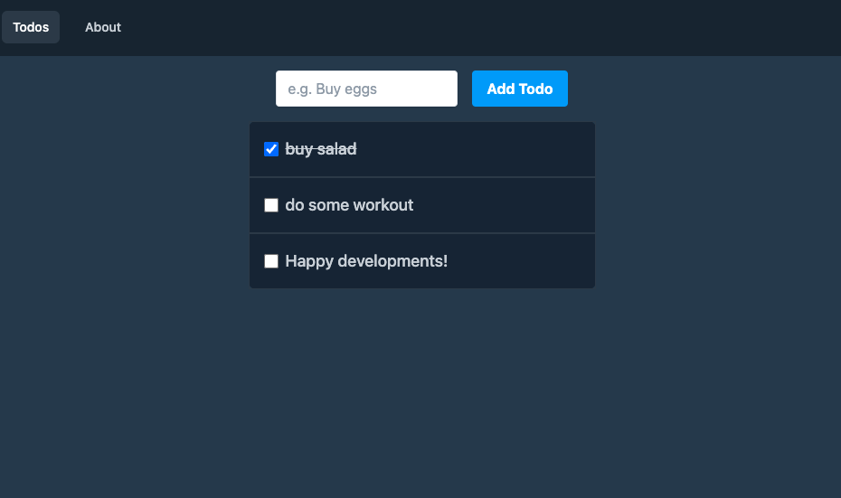

# SvelteのTodoアプリ

## 概要



Svelte(ts)の基礎の勉強するためのTODOアプリ

## ベース

Svelte
Vite
TailwindCSS
Supabase(バックエンド代わり)

## インストール

- `yarn install` 後、supabase関連のAPIKEY等を`.env.local` にセット（他バックエンド使用時、`/libs/supabase.ts`をリプレイスすること）
- `yarn dev`で開発環境を実行

## 機能

### Routing

`svelte-routing`でルート・リンクを設定

```svelte
<script>
  import { Router, Route, Link } from 'svelte-routing'
  import About from './pages/About.svelte';
  import Home from './pages/Home.svelte'
  
  export let url = '' // SSR用の現在のURLが入る。basePath かどっちかを入れる必要あり
</script>

<Router url="{url}">
  <Link to="/">Home</Link>
  <Link to="/about">About</Link>

  <Route path="/" component="{Home}" />
  <Route path="/about" component="{About}" />
</Router>
```

### State管理

`svelte/store`を使用
ミュータブルな`writable`、イミュータブルな`readable`、他のStoreに依存してる場合は`derived`を使用
グローバルに使える（ローカルステートは、`let count`で十分）

```svelte
import { writable } from "svelte/store"

const count = writable(0)

...
count.update(value => value + 1) // ミューテーション

<p>count is : {$count}</p> // $つけると、値をそのまま参照できる
```
